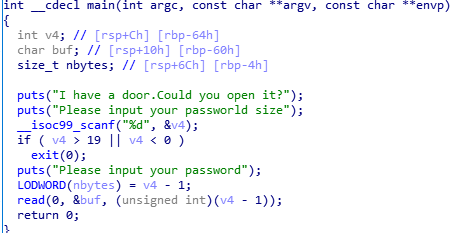

## 赛题设计说明

###　题目信息
* 题目名称：easy_pwn
* 预估难度：简单（简单/中等/困难）
* 编译命令：gcc -o easy_pwn  -fno-stack-protector -no-pie easy_pwn.c

### 题目描述

>真实的easy_pwn 十分简单的栈溢出

### 题目考点

1. 基本栈溢出的利用——简单的IDA使用和脚本编写
2. 有符号数转化成无符号数的变化

### 思路简述

首先利用有符号数转化成无符号数的规则绕过对size的检测，然后栈溢出覆盖返回地址跳转到后门函数拿到shell

### 题目提示

1. 咦，把有符号数直接赋值给无符号数会发生什么？
2. 这道题好像跟靶场上的easy_stack很像哦，可以参考Wood1314.github.io上的题解

### 题目环境

Ubuntu 16.04

### 题目 writeup：

打开IDA分析题目

发现最后`v4-1`这个无符号数作为`read`读取字符个数的参数。由于补码的性质，我们只要使`v4`为0，就可以让`read`读入`0xffffffffffffffff`个字节足够使得栈溢出。

后面做法就是常规栈溢出做题方法了。
